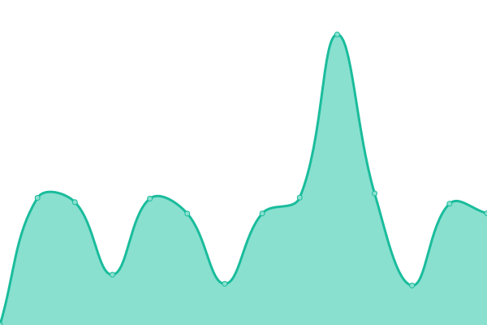

# [📈 Live Status](https://instruxmedia.github.io/webserver-uptime): <!--live status--> **🟩 All systems operational**

This repository contains the open-source uptime monitor and status page for [Instrux Media](https://www.instruxmedia.com), powered by [Upptime](https://github.com/upptime/upptime).

With [Upptime](https://upptime.js.org), you can get your own unlimited and free uptime monitor and status page, powered entirely by a GitHub repository. We use [Issues](https://github.com/instruxmedia/webserver-uptime/issues) as incident reports, [Actions](https://github.com/instruxmedia/webserver-uptime/actions) as uptime monitors, and [Pages](https://instruxmedia.github.io/webserver-uptime) for the status page.

<!--start: status pages-->
<!-- This summary is generated by Upptime (https://github.com/upptime/upptime) -->
<!-- Do not edit this manually, your changes will be overwritten -->
<!-- prettier-ignore -->
| URL | Status | History | Response Time | Uptime |
| --- | ------ | ------- | ------------- | ------ |
|  [Company Website](https://www.instruxmedia.com) | 🟩 Up | [company-website.yml](https://github.com/instruxmedia/webserver-uptime/commits/HEAD/history/company-website.yml) | 

 446ms
     
 | 

<a href="https://instruxmedia.github.io/webserver-uptime/history/company-website">100.00%</a>
    

|  HC LMS | 🟩 Up | [hc-lms.yml](https://github.com/instruxmedia/webserver-uptime/commits/HEAD/history/hc-lms.yml) | 

 728ms
     
 | 

<a href="https://instruxmedia.github.io/webserver-uptime/history/hc-lms">100.00%</a>
    

|  DFO LMS | 🟩 Up | [dfo-lms.yml](https://github.com/instruxmedia/webserver-uptime/commits/HEAD/history/dfo-lms.yml) | 

 372ms
     
 | 

<a href="https://instruxmedia.github.io/webserver-uptime/history/dfo-lms">100.00%</a>
    

|  Staging Portal | 🟩 Up | [staging-portal.yml](https://github.com/instruxmedia/webserver-uptime/commits/HEAD/history/staging-portal.yml) | 

 549ms
     
 | 

<a href="https://instruxmedia.github.io/webserver-uptime/history/staging-portal">100.00%</a>
    

|  IDP | 🟩 Up | [idp.yml](https://github.com/instruxmedia/webserver-uptime/commits/HEAD/history/idp.yml) | 

 498ms
     
 | 

<a href="https://instruxmedia.github.io/webserver-uptime/history/idp">100.00%</a>
    

|  Dropzone | 🟩 Up | [dropzone.yml](https://github.com/instruxmedia/webserver-uptime/commits/HEAD/history/dropzone.yml) | 

 296ms
     
 | 

<a href="https://instruxmedia.github.io/webserver-uptime/history/dropzone">100.00%</a>
    

<!--end: status pages-->

[**Visit our status website →**](https://instruxmedia.github.io/webserver-uptime)

## 📄 License

- Powered by: [Upptime](https://github.com/upptime/upptime)
- Code: [MIT](./LICENSE) © [Instrux Media](https://www.instruxmedia.com)
- Data in the `./history` directory: [Open Database License](https://opendatacommons.org/licenses/odbl/1-0/)
